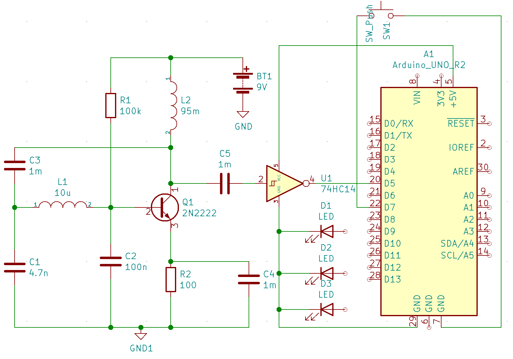
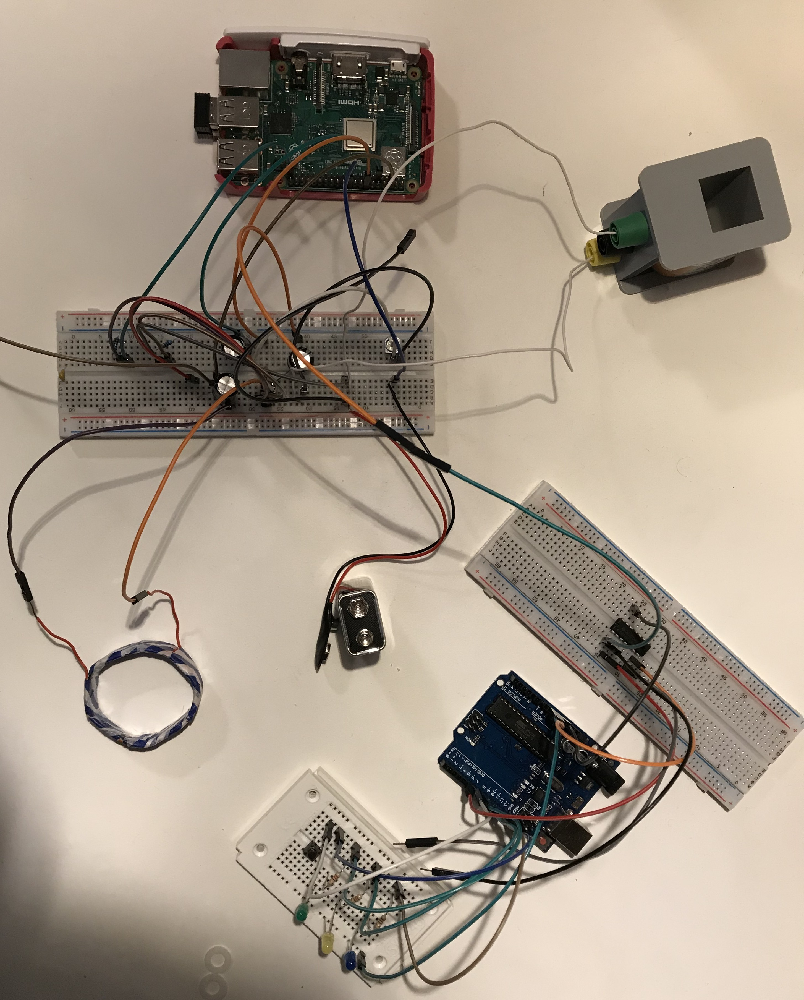
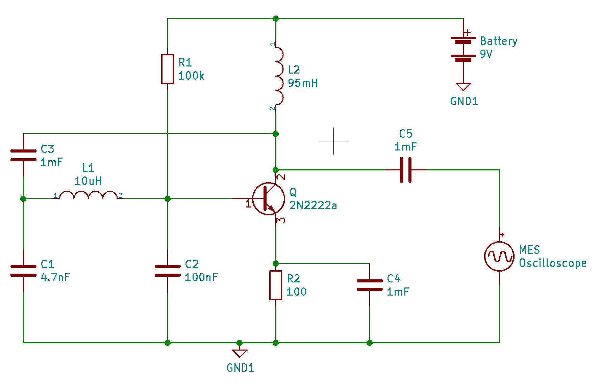

# Inductive proximity sensor (and investigation of its characteristics)

This is a project which uses a Colpitt's Oscillator (a certain LC circuit) to detect conducting (because that's where induction happens) objects in the vicinity of its coil by registering changes in the frequency of oscillation of the LC circuit. These changes are detected and indicated using LEDs by an arduino with the `proximity-sensor.ino` program.

Moreover I also investigated the characteristics of this sensor meaning that I looked at the different frequency and voltage changes with different conducting objects which I then also plotted in several nice graphs.

This was the problem number 3 from the 2021 [IYPT](https://www.iypt.org/).

## A sensor program: `proximity-sensor.ino`

To find out if a frequency changes you first need to be able to measure it. For this I want to point to these ways to do that:

* [One Transistor Frequency Counter](https://www.onetransistor.eu/2018/09/how-to-count-frequency-with-arduino.html)
* [Nick Gammon Frequency Counter](http://www.gammon.com.au/timers)

`proximity-sensor.ino` uses the one from One Transistor and then builds up logic on top of the frequency counting to trigger changes in frequency.

The setup with the arduino is built according to this schematic:

In reality this looks like this:

## Investigation on sensor circuit properties and behavior in different circumstances

The scripts in `data-collection` are used to collect the raw data from the Hantek USB Oscilloscope using the [OpenHantek API](https://github.com/Ho-Ro/Hantek6022API) and extract frequency and voltage amplitude data from it.

Then the data was interpreted and plotted with `plotting_and_regression.ipynb`.

The circuit with the oscilloscope looks like this (here I just replaced the Schmitt-Trigger and the Arduino with an Oscilloscope):

